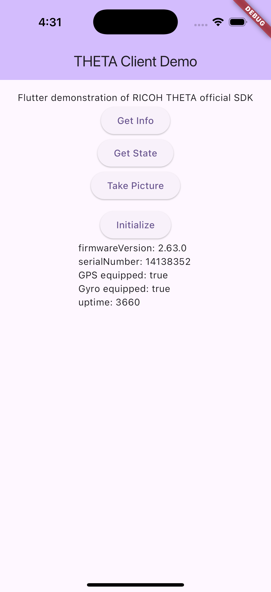
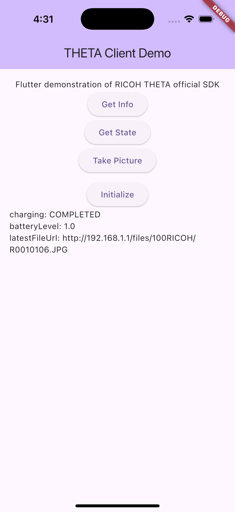
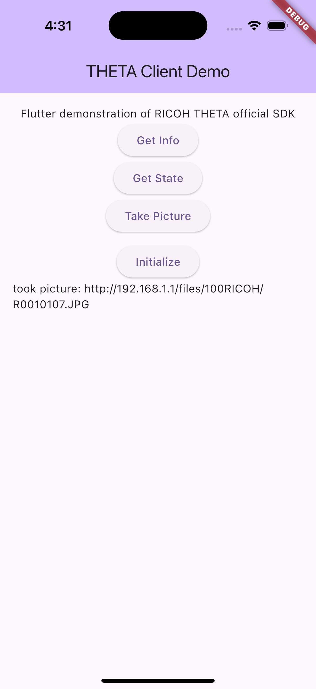

# tc_flut_d1

theta-client Flutter Demo #1.

Simple example of using theta-client Flutter SDK from a
new Flutter project.

## Usage

The RICOH THETA must be connected to the mobile device via WiFi.

```bash
flutter pub get
flutter run
```







